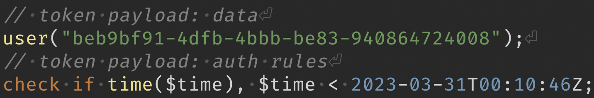
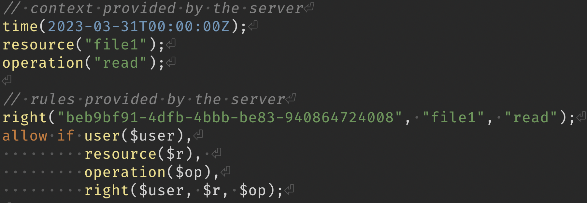

# What is auth?

::: notes
| overloaded term. gathers two concepts
:::

---

<div style="display: flex;">
  <div style="flex-grow: 1; text-align: center;"><h2>Authentication</h2></div>
  <div style="flex-grow: 1; text-align: center;"><h2>Authorization</h2></div>
</div>

---

<div style="display: flex;">
  <div style="flex-grow: 1; text-align: center;"><h2>Authn</h2></div>
  <div style="flex-grow: 1; text-align: center;"><h2>Authz</h2></div>
</div>

::: notes
| authentication: who are you?
| authorization: what can you do?
| usually authentication is used to determine authorization, but
| that is not always the case
:::

---

# Distributed systems

::: notes
| a distributed system is about running different bits of software
| on different pieces of hardware.
:::

---

:::bigimage

:::

---

# [compartimentalize]{.jumbo}

::: notes
| The goal is to create boundaries
| to compartimentalize stuff (hardware failures, resource use,
| teams management, blast radius of a bug / vuln)
:::

<!--
---

# hardware failure

---

# [compartimentalize]{.jumbo}

---

# resource use

---

# [compartimentalize]{.jumbo}

---

# trust scopes

---

# [compartimentalize]{.jumbo}

---

# teams

---

# [compartimentalize]{.jumbo}

-->

---

# Tradeoffs

---

# Latency

<!--
---

# new failure modes

::: notes
| the biggest tradeoff is that turning local calls into network
| calls creates tons of new failure modes, 
:::

---

# latency (network calls)

::: notes
| + performance considerations
| when aggregating data,  that you have to account for.
:::

---

# data fragmentation

::: notes
| compartimentalization is also a drawback: a central data model is very
| convenient. moving away from that makes things harder:
| either the data is replicated from somewhere and possibly out of date
| or it is just not available locally
:::

-->

---

# Monolith, [[fewer problems]{}]{.incremental}

---

:::bigimage

:::

::: notes
| if you can afford a monolith (tolerate hardware failure,
| team coupling, etc), then all sorts of problems disappear
:::

---

# kthxbai

::: notes
| for the rest of the talk we will assume that we are in the context
| where a distributed system is required (for whatever reason)
:::

---

# Auth in a distributed system

::: notes
| authorization is a cross-cutting concern. in most cases each entity
| will have to perform authorization on incoming requests.
| it's also often something that you somehow want to manage centrally.
| chasing access rules across a distributed architecture is a nightmare
:::

---

# [Don't panic]{.jumbo}

---

:::bigimage

:::


::: notes
| the good thing is that you can choose where you apply decentralization
| what's important is staying aware of the dependencies between services
| and the actual call graph triggered by an incoming request. it will
| give you a good idea of possible failure modes and of the actual
| cost of tradeoffs
:::

---

# Centralized auth in a distributed system

---

# Distributed auth in a distributed system

---

<h1 style="z-index: 2; background-color: rgba(255,255,255, 0.3);">Centralized</h1>

:::bigimage

:::

::: notes
| every node calls out to the auth service.
| conceptually simple, but the auth service is a SPOF
| some guarantees are still lost
| reliance on operational guarantees from the auth service: see zanzibar
| all in all, it's an okay architecture, even though the auth service
| is a spof: you can limit the scope of the auth service to make it
| more robust and accept this failure mode
:::

---

<h1 style="z-index: 2; background-color: rgba(255,255,255, 0.3);">Decentralized</h1>

:::bigimage

:::

::: notes
| if you want truly autonomous nodes and an auth service spof is
| not possible.
:::

---

# challenges

::: notes
more frightening than centralized auth, even though it brings super interesting
properties
:::

---

# distributed trust

::: notes
| in this setup, there is no central auth system that you can query
| for fresh information. you have to rely on bearer tokens
:::

---

# incomplete data

::: notes
| in this setup, a service may carry enough information to make
| auth decisions, so sometimes a cache of external context is required
:::

---

# stale data

::: notes
| this cache can become stale
| bearer tokens themselves can become stale. need for revocation
:::

---

# Bearer tokens (boring)

- JWT (super common, can be tricky)
- PASETO (JWT without the footguns)
- Roll your own tokens

::: notes
| Since services cannot call out to a central auth service, services need a way
| to trust information. A common way to do that is signed tokens
| JWT / PASETO / custom tokens: payload + signature. It's up to the services
| to actually interpret it. Conventions in the JWT world with well-known claims
:::

---

# Bearer tokens (fancy)

- Macaroons
- Biscuits

::: notes
| Macaroons: caveat system for describing constraints
| Biscuits: embedded logic language for describing constraints & access rules
:::

---

# Biscuit

::: incremental
- spec + implementations
:::

::: incremental
- token format (crypto)
- token format (payload)
- authorization rules (semantics)
:::

::: incremental
- public key crypto (ed25519)
- offline attenuation
:::

::: notes
| biscuit is a spec, it defines both a token format (crypto and payload), as
| well as a dedicated language used to describe authorization rules.
| several implementations are available (rust + wasm derivatives, haskell, java, go, etc)
| the token itself relies on ed25519 signatures, so it works with keypairs
| a token contains an authority block, signed by the token emitter, but it can
| also contain *attenuation blocks*, that can be *freely* added to a token
| (ie without needing the signing key). such blocks can only restrict a token
| scope
:::

---

# Biscuit: token

<!--
```biscuit-datalog
// token payload: data
user("beb9bf91-4dfb-4bbb-be83-940864724008");
// token payload: auth rules
check if time($time), $time < 2023-03-31T00:10:46Z;
```
-->


```
EsUBClsKJGJlYjliZjkxLTRkZmItNGJiYi1iZTgzLTk0MDg2NDcyNDAwOBgDIgkKBwgKEgMYgAgyJgok
CgIIGxIGCAUSAggFGhYKBAoCCAUKCAoGIIbKmKEGCgQaAggAEiQIABIglxFlJnk5NxQluiM2rKlUgZGw
jUF64-bwhaTOCq3JcooaQPTn4mky1je8bJgf2KRCKa8mX11b4hE110Pa48qd6iPbEzzZcV6o51eTCCz4
bh2BXPDhR9_7ZKCGSByb37pIzAkiIgogOLbyK34IreFp76u96usfcb2GS1U-y2T7GY7zIp0RJSM=
```
::: notes
| here is an example of a token. it contains a regular payload, but also
| auth rules. the token itself can carry auth logic, and it's crucial in some
| architectures. auth logic in a token is purely restrictive: it can only deny
| access by failing, but is not enough in itself
| the token itself is serialized as a binary blob through protobuf and is usually
| base64 encoded when sent over the wire
:::

---

# Biscuit: auth rules

<!--
```biscuit-datalog
// context provided by the server
time(2023-03-31T00:00:00Z);
resource("file1");
operation("read");

// rules provided by the server
right("beb9bf91-4dfb-4bbb-be83-940864724008", "file1", "read");
allow if user($user),
         resource($r), 
         operation($op),
         right($user, $r, $op);
```
-->


::: notes
| the token itself can carry rules, but ultimately it's up to the receiving
| agent to decide whether or not to authorize. That is done with `allow if`
| usually the receiving agent will provide context (what is the operation
| that is currently attempted, on which resource, etc), more static rules
| like ACLs or capabilities, and finally a condition for allowing requests.
| the biscuit library then combines the token with the server policies, and
| computes the result of authorization policies
:::

---

# Biscuit: offline attenuation

<!--
```biscuit-datalog
// block appended by the token holder: the resulting
// token can only be used locally
check if source_ip("127.0.0.1");
```
-->


::: notes
| the biscuit crypto model allows a token holder to craft a new token by
| appending a block to an existing one. once added, blocks can not be removed,
| altered or reordered. The evaluation model guarantees that a block can only
| restrict a token's scope
:::

---

# Mitigating issues

::: notes
| the main issue with distributed auth and bearer tokens is that once
| a token has been created, there is no direct way to invalidate it.
| the only way you can do it is to tell everyone "stop accepting this
| token in particular"
:::

---

# [revocation]{.jumbo}

::: notes
| talking about token revocation could easily fill a 1h slot so we'll
| have to summarize
| have a basic revocation infra available from day 1, even if it's
| dumb. You'll thank yourself once you have to revoke a token.
| make sure every token is uniquely identifiable so it can be revoked
| without affecting other holders.
| if possible, keep a list of all the tokens you generate, so you can
| revoke them (you might know that a token has leaked without having
| access to the token itself). if tokens have unique ids, you can
| store them instead of the tokens, this way it's not sensitive info
| revocation and emission lists can only grow, so they need to be
| pruned at some point. the simplest way to do that is to give every
| token an expiration date, and then store this date in the emission
| and revocation lists. this way, pruning is easy.
:::

---

# [do it yesterday[]{.make-alternate}]{.jumbo}

::: notes
| have a basic revocation infra available from day 1, even if it's
| dumb. You'll thank yourself once you have to revoke a token.
| make sure every token is uniquely identifiable so it can be revoked
| without affecting other holders.
:::

---

# unique tokens

::: notes
| make sure every token is uniquely identifiable so it can be revoked
| without affecting other holders.
:::

---

# track tokens

::: notes
| if possible, keep a list of all the tokens you generate, so you can
| revoke them (you might know that a token has leaked without having
| access to the token itself). if tokens have unique ids, you can
| store them instead of the tokens, this way it's not sensitive info
:::

---

# expiration date

::: notes
| revocation and emission lists can only grow, so they need to be
| pruned at some point. the simplest way to do that is to give every
| token an expiration date, and then store this date in the emission
| and revocation lists. this way, pruning is easy.
:::

---

# [do it yesterday[]{.make-alternate}]{.jumbo}

---

# Access token / refresh token

<pre style="margin-left: auto; margin-right: auto;">
┌───────┐ auth data         ┌────────────────┐
│  user ├──────────────────▲│ token delivery │
└─────┬─┘▼──────────────────┤    service     │
   ▲  │    refresh token    └─────────┬──────┘
   │  │     + access token        ▲   │
   │  │                           │   │
   │  │   refresh token           │   │
   │  └───────────────────────────┘   │
   │                                  │
   └──────────────────────────────────┘
          access token
           + refresh token
</pre>

::: notes
| a good way to reduce tokens lifetime is to separate access tokens
| from refresh tokens. access tokens are bearer tokens with a
| predefinite validity period. refresh tokens are stateful and can
| be exchanged for access tokens. The access token delivery service
| is still a spof, but is not on the hot path for every request, so
| failure is more tolerable.
| adjusting the access token validity period lets you chose a
| compromise between freshness and resilience
:::

---

# Principle of least privilege

::: notes
| even with revocation in place, there is still latency. so reducing
| the blast radius during that vuln window is always a good thing.
:::

---

# Dedicated execution roles

::: notes
| of course you want people to have access to what they need, so 
| identity-based rules tend to be static.
| a good example is AWS execution roles you can define for lambdas
| where each lambda gets dedicated credentials that are only valid
| for the execution duration
:::

---

# Single use tokens on demand (better)

::: notes
| however, if you can deliver tokens crafted specially for the
| operations you're trying to carry out, you avoid a lot of issues
| it's not always feasible though, especially with central auth
| systems where creating new roles takes time (eg AWS)
:::

---

# Perf / latency tradeoff

::: notes
| it's not always feasible though, especially with central auth
| systems where creating new roles takes time (eg AWS)
| KMS has a dedicated feature, just for that: creating restricted access tokens
| without bothering with IAM
:::

---

# [✨offline attenuation ✨]{.jumbo}

::: notes
| what if you could generate single-use token on demand, in a hot path, with
| no perf cost?
|
| that's exactly what offline attenuation does
:::

---

# Key rotation

---

# [do it yesterday[]{.make-alternate}]{.jumbo}

::: notes
| same as for revocation, this has to be planned from day 1 because
| once you need it, you have to be fast.
| the best way to be prepared is to rotate keys regularly and make
| sure nothing breaks.
| rotating keys mandates that every token has an expiration date, so
| that you can retire keys without breaking anything
:::

---

# perform regular rotations

::: notes
| the best way to be prepared is to rotate keys regularly and make
| sure nothing breaks.
| rotating keys mandates that every token has an expiration date, so
| that you can retire keys without breaking anything
:::

---

# [do it yesterday[]{.make-alternate}]{.jumbo}

---

# Distributed auth patterns

::: notes
| now for some patterns. there are various ways to implement
| distributed auth. often you'll still require a bit of
| centralization. the question is how / where you do that and
| how much it affects other services
:::

---

# Auth gateway

<pre style="margin-left: auto; margin-right: auto;">
            trusted network
           ┌────────────────────────────────────┐
           │                                    │
           │                     services       │
           │                      ┌───┐         │
         ┌─┴┐      trusted        │   │  trusted│
         │  ├─────────────────────► 1 ├─────┐   │
         │g │                     └───┘     │   │
         │a │                               │   │
untrusted│t │                     ┌───┐     │   │
────────►│e │      trusted        │   │     │   │
         │w ├─────────────────────► 2 │◄────┘   │
         │a │                     └───┘         │
         │y │                                   │
         │  │                     ┌───┐         │
         │  │      trusted        │   │         │
         │  ├─────────────────────► 3 │         │
         └─┬┘                     └───┘         │
           │                                    │
           └────────────────────────────────────┘
</pre>

::: notes
| you usually already have an ingress where all incoming traffic
| is directed. so if you already have a spof, you can make it
| handle auth concerns without creating a new one.
| it is a very interesting pattern where a single incoming request
| can trigger several internal cross-service requests: the auth
| exposed to the outside can be completely separate from what's
| used between services internally. eg a stateful session exposed
| to users, and different mechanisms internally (eg trusted network,
| or bearer tokens)
:::

---

# challenges

---

# complexity @ ingress

::: notes
| makes the ingress logic more complicated, so it can affect its
| robustness.
| just half the story: how are internal calls authorized?
:::

---

# coarse-grained model

::: notes
| does the
| gateway need to know about every service internals so it can
| perform authorization. in practice this nudges into very coarse
| grained authz rules: rules that the gateway can check itself
| without too much knowledge of service internals.
| it's still a great solution for authentication if you let 
| services themselves perform authorization
:::

---

# confused deputy attacks

::: notes
| services can still be tricked into performing operations that
| they can do in theory but should be forbidden in a given
| context.
| especially in multi-tenant system, the service-level restrictions
| don't prevent a tenant from accessing data from another tenant
:::

---

# Internal calls with request-level restrictions

<pre style="margin-left: auto; margin-right: auto;">
              incoming credentials
             ┌─────────────┐
             │             │
             │   services  │
incoming     │   ┌────┐    │
─────────────┴──►│    │    │
request          │ 1  ├────▼┐
                 └────┘     │
                            │ authorized
                 ┌────┐     │ as incoming
                 │    │     │    request
                 │ 2  │◄────┘
                 └────┘
</pre>

::: notes
| the first service requires a token provided by the auth gateway
| and then passes it to subsequent calls. each service uses this
| token to perform auth.
| we get back request scoping and tenant isolation
:::

---

# Internal calls with offline attenuation

<pre style="margin-left: auto; margin-right: auto;">
              incoming credentials
             ┌─────────────┐
             │             │
             │   services  │
incoming     │   ┌────┐    │
─────────────┴──►│    │  ┌─┴───┐
request          │ 1  ├──┤magic│
                 └────┘  └─┬───┘
                           │ authorized as incoming
                 ┌────┐    │ request
                 │    │    │ (+ request-specific
                 │ 2  │◄───┘    restrictions)
                 └────┘
</pre>

::: notes
| same as before, but each service attenuates the token before
| passing it further. this way, even if a service is compromised,
| only dedicated tokens are leaked, so the blast radius is limited
| only feasible with offline attenuation, since it doesn't require
| crafting new credentials / roles. this can be done at a
| per-request/per-service level.
:::

---

# Token delivery service

<pre style="margin-left: auto; margin-right: auto;">
┌────────┐ auth data    ┌────────┐
│        ├─────────────►│token   │
│  user  │              │delivery│
│        │◄─────────────┤service │
└─┬────┬─┘  token(s)    └────────┘
  │    │
  │    │
  │    │                  ┌───────┐
  │    └─────────────────►│service│
  │                       │  1    │
  │                       └───────┘
  │
  │                       ┌───────┐
  └──────────────────────►│service│
                          │  2    │
                          └───────┘
</pre>

::: notes
| this one is interesting if you can directly expose services
| the user logs in at the token service, and gets access tokens
| they can use to access services directly. i used it at fretlink
| and it was super robust.
:::

---

# out of the hot path

::: notes
the auth service is called once and then services are accessed directly
:::

---

# challenges

---

# cross-service tokens

::: notes
| it added a bit of complexity because
| we had per-service tokens, but that could be avoided with biscuits
| a cross-service token requires some thought so that service-specific
| info doesn't conflict / doesn't get wrongfully interpreted by another
| service
| same as the auth gateway, a central source of truth requires a
| common auth model. this can be limiting.
:::

---

# Recap

::: incremental
- centralized auth is simpler…
- but SPOF-y
- decentralized auth is doable…
- but plan for REVOCATION
- Least Privilege Principle
- (offline attenuation is great)
- Eat biscuits
:::

---

# Biscuit next steps<br><small>(contributors welcome)</small>
  
- updated documentation
- biscuit-wasm
- biscuit-java update
- biscuit-python release

---

<div style="height: 100vh; display: flex; flex-direction: column; justify-content: space-evenly; align-items: center;">
## [biscuitsec.org](https://biscuitsec.org)
## [docs.biscuitsec.org](https://docs.biscuitsec.org)
## [github.com/biscuit-auth](https://github.com/biscuit-auth)
## [#biscuit-auth:matrix.org](https://matrix.to/#/#biscuit-auth:matrix.org)
</div>

<!--

---

# Plan

- comment choisir entre un système d'auth centralisé et un système distribué
- un tour d'horizon des solutions possibles pour les jetons au porteur;
- les différentes architectures d'auth possibles (passerelle d'auth, intégration directe, …);
- les éléments indispensables à mettre en place dans un tel système (rafraichissement des tokens, révocation, rotation des clés, …);
- la plateforme biscuit, construite autours de ces use cases.

---

# Centered title

---

# Centered title even when it's long and spans multiple lines

---

# Centered [[incremental]{}]{.incremental} title

---

# Top title

- With
- content

---

# Top title

::: incremental
- a
- b
- c
:::

---

# [Jumbo text]{.jumbo}

---

::: jumbogroup

## [a group of]{.jumbo}
## [big jumbo text]{.jumbo}
## [because it's fun]{.jumbo}

::::::::::

---

```haskell
test :: Test
test = do
  traverse (`xor` b) [test]
  
```

---

# Title that should be centered but is not because of notes

::: notes
| notes that are displayed because the right flag is added to the pandoc
| invocation. The leading `|` character allows to preserve line breaks,
| that's convenient in notes
:::

---

:::bigimage

:::

-->
